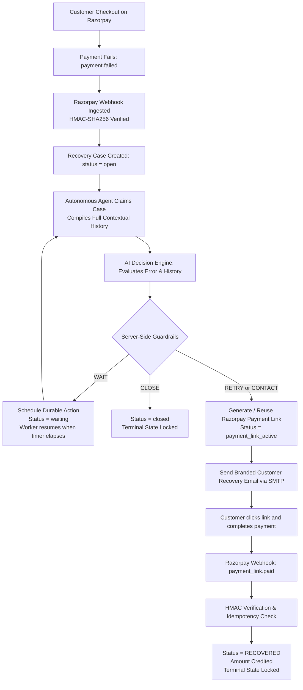

# RecoverAI 🚀
### Autonomous AI Revenue Recovery Agent for Razorpay Merchants

> **RecoverAI** is an autonomous revenue recovery engine that intercepts failed payments on Razorpay, uses an AI agent to analyze failure reasons and customer context, applies strict merchant guardrails, delivers branded recovery links to customers, and settles recovered revenue **exclusively** via verified Razorpay webhooks.

---

[](https://fastapi.tiangolo.com)
[](https://nextjs.org)
[](https://supabase.com)
[](https://pytest.org)
[](https://razorpay.com)
[](LICENSE)

---

## 📑 Table of Contents
1. [The Problem](#-the-problem)
2. [The Solution & Why It Is Agentic](#-the-solution--why-it-is-agentic)
3. [The Core Recovery Invariant](#-the-core-recovery-invariant)
4. [End-to-End Recovery Flow](#-end-to-end-recovery-flow)
5. [Key Features](#-key-features)
6. [Architecture & System Design](#-architecture--system-design)
7. [Technology Stack](#-technology-stack)
8. [Repository Structure](#-repository-structure)
9. [Local Developer Setup](#-local-developer-setup)
10. [Configuration & Environment Variables](#-configuration--environment-variables)
11. [Running Backend, Frontend & Tests](#-running-backend-frontend--tests)
12. [Razorpay Webhook & SMTP Configuration](#-razorpay-webhook--smtp-configuration)
13. [Security Architecture & Controls](#-security-architecture--controls)
14. [Demo Walkthrough for Evaluators](#-demo-walkthrough-for-evaluators)
15. [Known Limitations & Future Roadmap](#-known-limitations--future-roadmap)
16. [License](#-license)

---

## 💡 The Problem

In Indian e-commerce and SaaS, **10% to 15% of checkout transactions fail** due to temporary bank downtimes, customer OTP delays, network timeouts, or daily limit caps. 

Traditional payment recovery is broken:
- **Blind, Dumb Retries**: Blasting customer inboxes with generic emails annoys shoppers and hurts merchant brand reputation.
- **Manual Merchant Interventions**: Merchants manually download CSVs of failed transactions hours or days later—well after customer intent has evaporated.
- **Lost Revenue**: High-intent shoppers abandon carts permanently, directly eroding bottom-line profit.

---

## 🤖 The Solution & Why It Is Agentic

RecoverAI acts as a tireless, 24/7 autonomous financial recovery team:

1. **Context-Aware Reasoning**: Instead of treating every failure identically, our AI agent ingests the actual bank error code (`error_source`, `error_step`, `error_reason`), the customer's prior transaction history, and merchant risk parameters.
2. **Autonomous Decision-Making**: The agent chooses among distinct strategic recovery actions:
   - **`WAIT`**: For transient bank outages or network spikes, it calculates an optimal delay window (15m–24h) and schedules a durable recovery action.
   - **`RETRY` / `CONTACT`**: For actionable failures, it generates a time-limited Razorpay Payment Link and delivers a branded notification email with clear guidance.
   - **`CLOSE` / `SKIP`**: For fraud patterns or hard terminal declines (e.g. invalid card number), it conserves customer goodwill by closing the case.
3. **Deterministic Server Guardrails**: While the AI reasons probabilistically, execution is bound by hard merchant limits (max attempts, link expiry, wait bounds). The AI cannot hallucinate invalid transitions or exceed merchant budget rules.

---

## 🔒 The Core Recovery Invariant

> [!IMPORTANT]
> **STRICT RECOVERY INVARIANT**:
> - Creating a Razorpay payment link does **NOT** mark a payment as recovered.
> - Reusing an existing payment link does **NOT** mark a payment as recovered.
> - Sending an email to the customer does **NOT** mark a payment as recovered.
> - Scheduling a retry or executing an AI action does **NOT** mark a payment as recovered.
> - A manual merchant dashboard action does **NOT** mark a payment as recovered.
>
> A recovery case transitions to `recovered` **strictly and exclusively** upon receipt and cryptographic HMAC verification of a Razorpay `payment_link.paid` webhook event confirming genuine fund capture.

---

## 🔄 End-to-End Recovery Flow



---

## ✨ Key Features

- **Autonomous Background Workers**: Embedded daemon worker threads run continuous recovery cycles and claim durable delayed retries using atomic SQL lease locks.
- **Dynamic Razorpay Payment Links**: Generates contextual payment links with merchant-configured expiry windows (1–168 hours). Reuses existing active links to avoid spamming the gateway.
- **Branded Notification Engine**: Sends responsive HTML emails displaying the merchant's business name, support email, actual bank error explanation, payment link button, and expiry countdown.
- **Complete Merchant Command Center**: Next.js 15 dashboard featuring real-time recovery metrics, active case drawers, chronological audit activity timelines, and manual recovery overrides.
- **Merchant Onboarding & Multi-Section Settings**: Configurable store profile, Razorpay account connection, webhook setup instructions with copy buttons, and autonomous recovery rules.
- **Password Reset & Anti-Enumeration**: Secure `POST /api/v1/auth/forgot-password` and `POST /api/v1/auth/reset-password` flows using SHA-256 token hashing, 20-minute expiry windows, and zero email enumeration.
- **200 Passing Automated Tests**: Comprehensive test suite covering state machines, webhook idempotency, worker lease handling, and multi-tenant isolation.

---

## 🏗 Architecture & System Design

For a full technical deep dive with sequence diagrams, entity-relationship diagrams, and state machine transitions, see [`docs/architecture.md`](docs/architecture.md).

### Subsystems Overview
1. **Webhook Ingestion Layer**: Cryptographically validates Razorpay signatures, enforces event idempotency via `razorpay_webhook_events`, and maps events to tenant merchants.
2. **AI Reasoning & Guardrail Engine**: Integrates with local Ollama (`llama3.2:3b`) or cloud LLMs. Applies deterministic heuristics and hard attempt ceilings (`max_recovery_attempts`).
3. **Durable Scheduler**: Manages `scheduled_recovery_actions` table, polling due timers and reclaiming stale leases.
4. **State Machine (`app/services/recovery_state_machine.py`)**: Formalized states (`open`, `in_progress`, `waiting`, `payment_link_active`, `recovered`, `closed`) with immutable terminal states.
5. **Multi-Tenant Data Isolation**: Complete merchant data isolation (zero-IDOR) enforced at the database query level.

---

## 💻 Technology Stack

| Layer | Technologies |
|---|---|
| **Backend Framework** | [FastAPI](https://fastapi.tiangolo.com) (Python 3.11+, 3.14 compatible) |
| **ORM & Database** | [SQLAlchemy 2.0](https://www.sqlalchemy.org), [PostgreSQL](https://www.postgresql.org) / [Supabase](https://supabase.com), Psycopg3 driver |
| **Frontend Framework** | [Next.js 15](https://nextjs.org) (App Router, React 19, TypeScript) |
| **Styling** | Vanilla CSS Modules (Clean, responsive, zero heavy external UI dependencies) |
| **AI Inference** | [Ollama](https://ollama.ai) (`llama3.2:3b`) with deterministic rule fallbacks |
| **Payment Gateway** | [Razorpay API & Webhooks](https://razorpay.com/docs/api/) (Test & Live modes) |
| **Email Delivery** | Python `smtplib` / `email.message.EmailMessage` (Multipart HTML & text) |
| **Authentication** | Stateless JWT (HS256) + Passlib (Bcrypt) + SHA-256 token hashing |
| **Testing** | [Pytest](https://pytest.org), [FastAPI TestClient](https://fastapi.tiangolo.com/tutorial/testing/) |

---

## 📂 Repository Structure

```
recover-ai/
├── README.md                      # Primary project overview & documentation
├── LICENSE                        # MIT License
├── CONTRIBUTING.md                 # Development & contribution guide
├── .env.example                   # Master environment configuration template
├── .gitignore                     # Git ignore patterns for Python, Node, and secrets
│
├── docs/                          # Specialized documentation
│   ├── architecture.md            # Deep architecture, diagrams, state machine, ERD
│   ├── demo.md                    # 5-6 minute evaluator presentation guide
│   ├── deployment.md              # Production deployment & infrastructure guide
│   ├── security.md                # Detailed security architecture & controls
│   └── api.md                     # Complete REST API endpoint reference
│
├── database/                      # Database schema & migrations
│   ├── schema.sql                 # Complete consolidated PostgreSQL schema
│   ├── seed.sql                   # Development seed dataset
│   └── migrations/                # 16 sequentially numbered SQL migrations
│       ├── 001_create_razorpay_webhook_events.sql
│       ├── 002_add_razorpay_external_ids.sql
│       ├── ...
│       ├── 014_recovery_state_machine_and_link_lifecycle.sql
│       ├── 015_add_merchant_settings_and_recovery_configuration.sql
│       └── 016_add_merchant_password_reset_tokens.sql
│
├── backend/                       # FastAPI backend application
│   ├── requirements.txt           # Python backend dependencies
│   ├── .env.example               # Backend environment template
│   ├── app/
│   │   ├── main.py                # FastAPI entrypoint & background lifespan workers
│   │   ├── core/                  # Security, config, and database engine
│   │   │   ├── config.py          # Pydantic BaseSettings configuration
│   │   │   ├── database.py        # SQLAlchemy session & engine factory
│   │   │   └── security.py        # JWT, bcrypt, and SHA-256 token hashing
│   │   ├── models/                # SQLAlchemy declarative ORM models
│   │   │   ├── merchant.py        # Merchant entity & settings
│   │   │   ├── customer.py        # Customer profile & merchant scoping
│   │   │   ├── payment.py         # Payment failure & gateway identifiers
│   │   │   ├── recovery_case.py   # Recovery case state & link attributes
│   │   │   ├── scheduled_recovery_action.py # Durable scheduler jobs
│   │   │   ├── audit_log.py       # Append-only audit records
│   │   │   └── merchant_password_reset_token.py # Password reset token hashes
│   │   ├── schemas/               # Pydantic request/response validation models
│   │   ├── services/              # Autonomous engine & business logic
│   │   │   ├── recovery_state_machine.py     # State machine validation
│   │   │   ├── recovery_agent.py             # Agent reasoning loop
│   │   │   ├── recovery_agent_worker.py      # Background continuous agent thread
│   │   │   ├── recovery_decision.py          # AI prompt context & guardrails
│   │   │   ├── recovery_actions.py           # Action execution & link generation
│   │   │   ├── scheduled_recovery_actions.py # Durable delay scheduler worker
│   │   │   ├── razorpay_service.py           # Razorpay API client & signatures
│   │   │   ├── razorpay_webhooks.py          # Ingestion & settlement handlers
│   │   │   └── notification_service.py       # Branded email delivery & audit
│   │   └── api/                   # REST API routes
│   │       ├── router.py          # Master router aggregation
│   │       └── v1/                # v1 endpoints (auth, merchants, cases, etc.)
│   └── tests/                     # 200 comprehensive automated test cases
│       ├── test_password_reset.py # 14 dedicated password reset tests
│       ├── test_recovery_operations_hardening.py # Scenarios A-P
│       ├── test_merchant_isolation_and_idor.py   # Multi-tenant IDOR tests
│       └── ...
│
└── frontend/                      # Next.js 15 Merchant Web Application
    ├── package.json               # Frontend dependencies & scripts
    ├── .env.example               # Frontend environment template
    ├── app/                       # Next.js App Router pages
    │   ├── layout.tsx             # Root layout & providers
    │   ├── page.tsx               # Marketing landing page
    │   ├── dashboard/page.tsx     # Recovery Command Center
    │   ├── settings/page.tsx      # Multi-section onboarding & settings
    │   ├── customers/page.tsx     # Merchant customer management
    │   ├── login/page.tsx         # Merchant authentication
    │   ├── register/page.tsx      # Merchant self-registration
    │   ├── forgot-password/page.tsx # Password reset request route
    │   ├── reset-password/page.tsx  # Password reset completion route (Suspense)
    │   └── test-payment/page.tsx  # Interactive Razorpay checkout simulator
    ├── components/                # Modular UI components
    │   ├── dashboard.tsx          # Case feed, metrics & activity timeline drawer
    │   ├── merchant-settings.tsx  # Settings tabs, checklist, webhook copy guide
    │   ├── auth-form.tsx          # Login, Register, Forgot & Reset forms
    │   └── auth-provider.tsx      # Client-side JWT auth context & storage
    └── lib/
        └── api.ts                 # Typed fetch client with bearer auth
```

---

## ⚡ Local Developer Setup

### Prerequisites
- Python 3.11 or higher
- Node.js 18 or higher with npm
- PostgreSQL 15 or Supabase instance
- *(Optional)* [Ollama](https://ollama.ai) installed with model `llama3.2:3b`

### 1. Clone Repository & Setup Database
```bash
git clone https://github.com/your-username/recover-ai.git
cd recover-ai

# Apply database schema to your PostgreSQL / Supabase database:
psql "$DATABASE_URL" -f database/schema.sql
```

### 2. Setup & Run Backend
```bash
cd backend
python3 -m venv .venv
source .venv/bin/activate
pip install -r requirements.txt

# Create local environment configuration
cp .env.example .env
# Edit .env with your DATABASE_URL, Razorpay keys, and JWT secret

# Start FastAPI development server
uvicorn app.main:app --reload --port 8000
```
Backend API will be live at `http://localhost:8000` (docs at `http://localhost:8000/docs`).

### 3. Setup & Run Frontend
```bash
cd frontend
npm install

# Create local environment configuration
cp .env.example .env.local
# Set NEXT_PUBLIC_API_BASE_URL=http://127.0.0.1:8000

# Start Next.js development server
npm run dev
```
Frontend application will be accessible at `http://localhost:3000`.

---

## 🧪 Running Tests & Build Verification

### Backend Tests (200 Passing)
```bash
cd backend
python3 -m pytest -v
```
Expected output:
```
================== 200 passed, 1 warning, 24 subtests passed ==================
```

### Frontend Production Build
```bash
cd frontend
npm run build
```
Expected output:
```
✓ Compiled successfully
✓ Linting and checking validity of types
✓ Generating static pages (12/12)
```

---

## 📡 Razorpay Webhook & SMTP Configuration

### Setting Up Razorpay Webhooks
1. In the [Razorpay Dashboard](https://dashboard.razorpay.com), go to **Settings** → **Webhooks** → **Add New Webhook**.
2. Set the Webhook URL to: `https://<your-backend-domain>/api/v1/webhooks/razorpay` (or your ngrok URL during local testing).
3. Set a Webhook Secret and save the identical string to `RAZORPAY_WEBHOOK_SECRET` in `backend/.env`.
4. Subscribe to events: `payment.failed` and `payment_link.paid`.

### SMTP Customer Email Notifications
To enable actual email dispatch:
1. In `backend/.env`, set `EMAIL_ENABLED=true`.
2. Configure your SMTP provider credentials:
   ```env
   SMTP_HOST=smtp.gmail.com
   SMTP_PORT=587
   SMTP_USERNAME=your-email@gmail.com
   SMTP_PASSWORD=your-app-password
   SMTP_USE_TLS=true
   EMAIL_FROM="RecoverAI Store <noreply@yourdomain.com>"
   ```
*(Note: If `EMAIL_ENABLED=false`, payment links are still generated and recovery continues safely without network calls).*

---

## 🛡 Security Architecture & Controls

For the comprehensive security architecture document, see [`docs/security.md`](docs/security.md).

- **Multi-Tenant Isolation**: Zero-IDOR design ensures merchants cannot view or manipulate other merchants' customers, cases, or metrics. Cross-tenant access yields `404 Not Found`.
- **HMAC-SHA256 Webhooks**: Every webhook is verified against raw binary payload bytes before processing.
- **Idempotent Webhook Processing**: Unique event IDs prevent replay attacks and prevent double-counting recovered amounts.
- **State Machine Guardrails**: Terminal states (`recovered`, `closed`) are permanent and immutable.
- **Password Reset Security**: Raw tokens are never stored; only SHA-256 hashes are persisted with 20-minute expiry windows and anti-enumeration protections.
- **Secret Non-Leakage**: Server-side secrets are wrapped in Pydantic `SecretStr` and redacted from application logs.

---

## 🎬 Demo Walkthrough for Evaluators

For the full minute-by-minute demo script, exact curl commands, and talking points, see [`docs/demo.md`](docs/demo.md).

### Quick 3-Step Demo
1. **Trigger Payment Failure**: Fire a `payment.failed` webhook into `/api/v1/webhooks/razorpay`.
2. **Observe Autonomous Agent**: The case appears on the dashboard, the autonomous worker assesses the bank failure reason, generates a Razorpay payment link, and sends a branded email to the customer.
3. **Simulate Payment**: Fire a `payment_link.paid` webhook into the endpoint. Observe the status transition to `recovered`, the metric increment, and the permanent state lock.

---

## 🔮 Known Limitations & Future Roadmap

- **Multi-Channel Outreach**: Currently supports email notifications via SMTP. Future iterations will add WhatsApp Business API and SMS recovery reminders.
- **Advanced Predictive Churn**: Incorporating customer lifetime value (LTV) models to automatically prioritize high-value recovery cases.
- **Auto-Discount Incentives**: Dynamically offering limited-time promotional discounts on high-friction payment links when permitted by merchant settings.

---

## 📄 License

Distributed under the **MIT License**. See [`LICENSE`](LICENSE) for more information.
