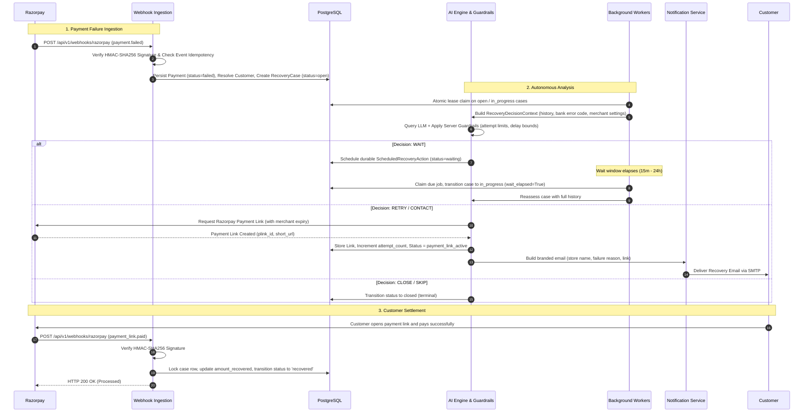
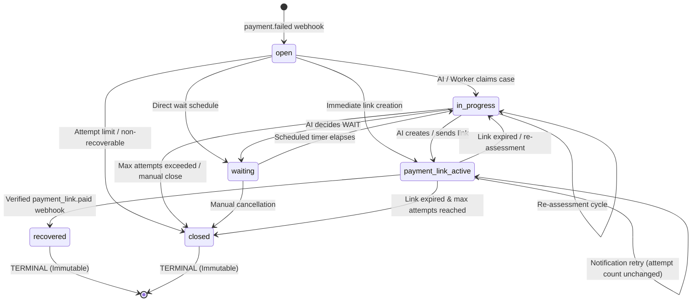
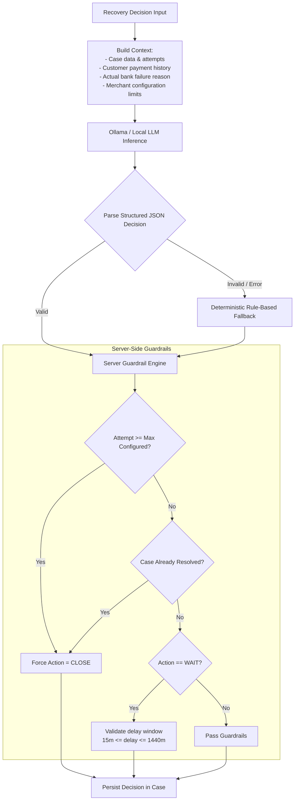
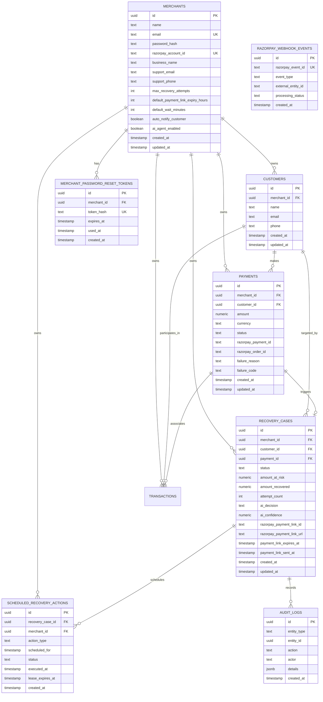

# RecoverAI Architecture Deep Dive

This document provides a comprehensive technical breakdown of the architecture, subsystems, state machines, and data models powering RecoverAI.

---

## 1. High-Level System Architecture

RecoverAI is structured as an autonomous, event-driven recovery engine composed of a **FastAPI backend**, an **autonomous background worker system**, an **AI decision engine**, and a **Next.js 15 merchant control center**.

```mermaid
flowchart TD
    subgraph External Systems
        RZP[Razorpay Payment Gateway]
        CUST[End Customer]
        SMTP[SMTP Mail Server]
        LLM[Ollama / Local LLM Engine]
    end

    subgraph RecoverAI Platform
        subgraph Ingestion & Security
            WH[Webhook Ingestion\nPOST /api/v1/webhooks/razorpay]
            HMAC[HMAC-SHA256 Signature Verification]
            IDEM[Webhook Idempotency Layer]
        end

        subgraph Core Engine
            RC[Recovery Case Manager]
            SM[Recovery State Machine]
            AIE[AI Decision Engine & Guardrails]
            RA[Recovery Action Executor]
        end

        subgraph Background Workers
            CAW[Continuous Agent Worker\nDaemon Thread (10s)]
            SRAW[Scheduled Recovery Worker\nDaemon Thread (15s)]
        end

        subgraph Database & Persistence
            DB[(PostgreSQL / Supabase)]
        end

        subgraph Merchant Experience
            API[FastAPI REST API v1]
            FE[Next.js 15 Merchant Dashboard]
        end
    end

    RZP -->|payment.failed webhook| WH
    WH --> HMAC --> IDEM --> RC
    RC --> DB
    CAW -->|Poll unhandled open cases| RC
    SRAW -->|Poll due wait jobs| DB
    RC --> AIE
    AIE <-->|Prompt / JSON Decision| LLM
    AIE -->|Guarded Decision| RA
    RA -->|Create Payment Link| RZP
    RA -->|Send Recovery Email| SMTP
    SMTP -->|Email with Recovery Link| CUST
    CUST -->|Click Link & Pay| RZP
    RZP -->|payment_link.paid webhook| WH
    WH -->|Settle & Recover| SM
    FE <-->|JWT Authenticated REST| API
    API <--> DB
```

---

## 2. End-to-End Recovery Lifecycle

The complete recovery journey guarantees autonomous execution while strictly enforcing that **only Razorpay payment webhooks can mark a case recovered**.



---

## 3. The Strict Recovery Invariant

> [!IMPORTANT]
> **Core Architectural Invariant**:
> - Creating a Razorpay payment link does **NOT** recover a payment.
> - Reusing an existing payment link does **NOT** recover a payment.
> - Sending a recovery email does **NOT** recover a payment.
> - Scheduling or executing a retry does **NOT** recover a payment.
> - An AI decision does **NOT** recover a payment.
> - A manual merchant dashboard action does **NOT** recover a payment.
> 
> A recovery case transitions to `recovered` **strictly and exclusively** upon receipt and cryptographic verification of a Razorpay `payment_link.paid` webhook.

---

## 4. State Machine Architecture

The lifecycle of a recovery case is governed by `app/services/recovery_state_machine.py`. Any invalid transition raises an `InvalidStateTransitionError`.



### State Machine Transition Table
| Current State | Allowed Next States | Trigger |
|---|---|---|
| `open` | `in_progress`, `waiting`, `payment_link_active`, `closed` | Background claim, scheduled wait, direct link, or guardrail close |
| `in_progress` | `in_progress`, `waiting`, `payment_link_active`, `closed` | Reassessment, wait schedule, link generation, or attempt limit |
| `waiting` | `in_progress`, `closed` | Scheduled action timer elapsed, or merchant manual closure |
| `payment_link_active` | `in_progress`, `payment_link_active`, `recovered`, `closed` | Reassessment, email re-send, customer payment settled, or expiry closure |
| `recovered` | *None* | **Terminal state**. Locked permanently. |
| `closed` | *None* | **Terminal state**. Locked permanently. |

---

## 5. AI Decision Engine & Guardrails

The AI decision engine (`app/services/recovery_decision.py`) evaluates payment failures dynamically while keeping execution strictly bound by deterministic code.



### Guardrail Guarantees
1. **Hard Maximum Attempts**: If `attempt_count >= merchant.max_recovery_attempts` (default 3), the action is strictly forced to `close`.
2. **Timing Validation**: All `wait` recommendations must have an explicit, bounded delay (`wait_minutes` between 15 and 1440). If out of range, the guardrail clamps or provides a safe default.
3. **No Infinite Loops**: When an action resumes after a wait period (`wait_elapsed=True`), the engine prevents scheduling back-to-back waits without forward progress.

---

## 6. Background Worker Subsystems

RecoverAI runs two background worker threads embedded within the FastAPI application lifespan:

### A. Continuous Recovery Agent Worker (`app/services/recovery_agent_worker.py`)
- **Poll Interval**: 10 seconds (configurable via `RECOVERY_AGENT_POLL_SECONDS`).
- **Function**: Queries cases in `open` or unhandled states belonging to merchants with `ai_agent_enabled=True`.
- **Atomic Lease Claiming**: Claims cases using an in-memory lease mechanism to prevent concurrent workers from processing the same case twice.
- **Cooldown & Safety**: Cases undergoing active payment link waiting or recent action are skipped to respect customer patience.

### B. Scheduled Recovery Worker (`app/services/scheduled_recovery_actions.py`)
- **Poll Interval**: 15 seconds (configurable via `RECOVERY_SCHEDULER_POLL_SECONDS`).
- **Function**: Scans `scheduled_recovery_actions` where `status = 'pending'` and `scheduled_for <= NOW()`.
- **Atomic Claiming**: Uses atomic SQL updates (`UPDATE ... WHERE status = 'pending' RETURNING id`) to claim jobs safely across multiple instances.
- **Continuation**: Transitions the case back to `in_progress` and invokes the AI decision engine with `wait_elapsed=True` for subsequent action.

---

## 7. Database Entity Relationship Model



---

## 8. Multi-Tenant Merchant Isolation (Zero-IDOR)

Every request reaching the RecoverAI API is subject to strict merchant tenancy boundary checks:
1. **JWT Verification**: The `Authorization: Bearer <token>` header is decoded and validated; the merchant record is extracted as the request context (`current_merchant`).
2. **Explicit Foreign Key Enforcement**: Queries for customers, recovery cases, payments, and settings filter strictly on `merchant_id == current_merchant.id`.
3. **Absence Over Error**: If Merchant A attempts to query an ID belonging to Merchant B, the API returns a generic `404 Not Found` (never a `403 Forbidden` that leaks entity existence).
4. **Unique Scopes**: Customer uniqueness is enforced per-merchant `(merchant_id, email)`, allowing different merchants to serve the same consumer independently.
